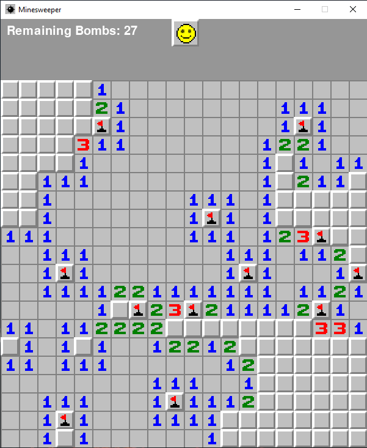

# Minesweeper Game in Python

A Single Player Game that objective it is to clear a rectangular board of hidden mines. Numbers on the revealed stones correlate to the number of hidden bombs around that stone. With logic and sometimes a bit of luck you should be able to flag all bombs (right click).

### Goals of the Game:
1. flag all bombs (right click)
2. reveal all other stones (which do not contain a bomb)  (left click)

### You lose if:
1. ... you've clicked on a bomb.

To Start a new Game press "n" - key

You can configure the number of Squares in x and y direction and even decied on the number of bombs
